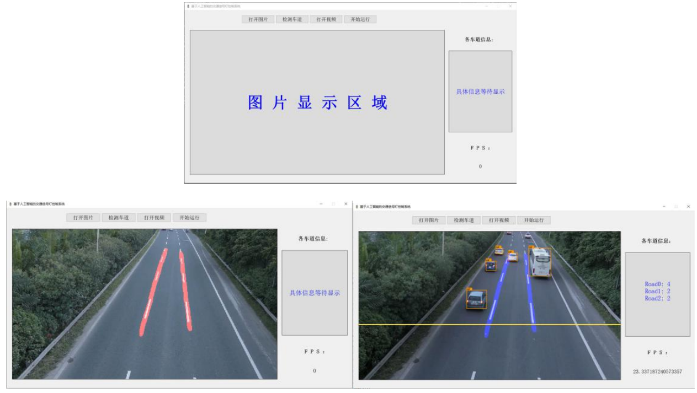

# YOLOv5-Mobilenetv2-LaneNet
A lane-divided vehicle flow statistics system. The tracking algorithm is SORT. 

## Dataset

Dataset for YOLOv5-Mobilenetv2: UA-DETRAC

Dataset for LaneNet: self-maded dataset

## How to use

### Download the weights file: 

链接：https://pan.baidu.com/s/1k7ruMljbUQIZnqeFSnn4xw 
提取码：cai6

### Put an vehicle flow video and one of the frame with few vehicles in `./data/images`

#### Run the following command:

```
python main.py
```

## Graphical User Interface(GUI) 



## Reference

https://github.com/ultralytics/yolov5

https://github.com/harryhan618/LaneNet

https://github.com/abewley/sort